# Hi there, I'm Muhammad Anas! 👋 (he/him)
### Full Stack Engineer | Python & React Specialist

> Creating secure, scalable, and responsive web products 🚀

      

---

## 👤 About Me

I'm a passionate Full Stack Software Engineer focused on building robust architectures, mock APIs, and engaging user interfaces. I love bridge building between backend APIs and front-end user experiences.

## 🚀 Core Info

- 🔭 I’m currently working on [KarobaarConnect Marketplace](https://github.com/AnasJadoon31/KarobaarConnect)
- 🌱 I’m currently learning **System Design, Kubernetes & WebAssembly**
- 👯 I’m looking to collaborate on **FastAPI plugins and custom UI component libraries**
- 📍 Located in **Karachi, Pakistan**

## 🛠️ Tech Stack & Skills

  
  
  
  
  
  
  
  
  
  
  
  
  
  
  
  
  

## 🌟 Featured Projects

| Project | Description | Tech Stack |
| :--- | :--- | :--- |
| [project-manager](https://github.com/AnasJadoon31/project-manager) | A lightweight React app to manage team projects and tasks in real-time. | `React` `Node.js` `Socket.io` |
| [Mock-Nadra-API](https://github.com/AnasJadoon31/Mock-Nadra-API) | FastAPI + PostgreSQL powered mock of identity database system supporting token JWT auth. | `Python` `FastAPI` `SQLite` |
| [KarobaarConnect-Standee](https://github.com/AnasJadoon31/KarobaarConnect-Standee) | Interactive frontend interface showcase standee for local commerce connection. | `JavaScript` `HTML5` `CSS3` |

## 📊 GitHub Analytics

  

  
  

  

---

*"Talk is cheap. Show me the code."* - *Linus Torvalds*

